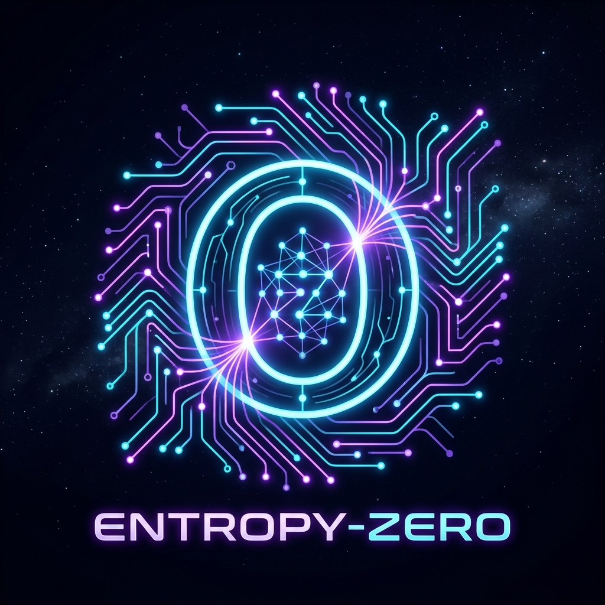

# Entropy-Zero: The Autonomic Social Engine

<p align="center">
  
</p>

[](https://entropy-zero.vercel.app)
[](https://github.com/jaysid97/entropy-zero/raw/main/Entropy-Zero_Pitch_Deck.pptx)
[](https://opensource.org/licenses/MIT)

**Entropy-Zero** is a futuristic, self-organizing social-computational coordination system for engineering teams. It replaces traditional, high-entropy administrative frameworks (like status updates, manual ticket routing, daily standups, and planning alignments) with a passive, telemetry-driven team nervous system.

Live Web Application & Pitch Deck: **[https://entropy-zero.vercel.app](https://entropy-zero.vercel.app)**

---

## 🎯 Problem Statement
In modern engineering organizations, teams spend up to **62% of their operational energy on "work-about-work"**—backlog grooming, coordinating assignments, daily status check calls, and manual logging in task boards. 
*   **Coordination Decay**: As a team scales, communication pathways grow exponentially, driving actual building capacity toward zero.
*   **Focus Fragmentation**: Constant status requests and context switches shatter developer flow states.
*   **Static Backlogs**: Backlog boards (like Jira) become outdated instantly and fail to adapt to real-time developer fatigue and focus constraints.

---

## 🧠 Solution Overview
Entropy-Zero models team collaboration as a self-healing biological nervous system that drives administrative overhead (coordination entropy) to zero:

1.  **Passive Telemetry Workspace**: Mined from ambient workspace behaviors (IDE modifications, git logs, focus blocks, Slack chatter patterns) to build a dynamic skill and fatigue map with zero developer manual input.
2.  **Autonomic Work Router**: Treats tickets as physical kinetic forces that automatically home in on the developer with the optimal load reserve and specialization matching. Automatically re-balances task loads during shocks (e.g. OOO events, Sev-1 outages).
3.  **Consensus Synapse Resolver**: Auto-detects design conflicts in team chats, spins up weighted voting ballots routed to module code experts, and automatically merges changes once consensus is resolved.

---

## 🛠️ Technology Stack
*   **Core Architecture**: React (Vite)
*   **Visual Physics Engine**: HTML5 Canvas 2D API with custom spring, gravity, and repulsion forces
*   **Design & UI System**: Custom Vanilla CSS (HSL design variables, glassmorphic filters, responsive layout structures, glowing micro-animations)
*   **Deployment**: Hosted permanently on Vercel Edge

---

## 🤖 AI Models & Tools Used
This project was developed with the assistance of Advanced Agentic AI pair programming tools, specifically using **Gemini 3.5 Flash (Medium)**.
*   **Architectural Concept**: Generating the autonomic, physics-inspired coordination model.
*   **Code Generation**: Scaffolding the React components structure, physics calculations for Canvas node attractions, and weighted consensus calculators.
*   **Telemetry Mocking**: Building and tuning the simulated stress injector and logger pipelines.
*   **Widescreen Pitch Slide Design**: Writing the automated pptx-generation codebase and CSS glass cards sliders.

---

## 🚀 Setup & Installation

To run this application locally on your machine, ensure you have [Node.js](https://nodejs.org) installed, and run:

```bash
# 1. Clone the repository
git clone https://github.com/jaysid97/entropy-zero.git

# 2. Navigate to the project directory
cd entropy-zero

# 3. Install dependencies
npm install

# 4. Start the local development server
npm run dev
```

*Open [http://localhost:5173/](http://localhost:5173/) in your browser to view the application.*

---

## 👥 Team Information
*   **Team Name**: Team Entropy-Zero
*   **Members**: 
    *   **jaysid97** (Developer / Submitter)
